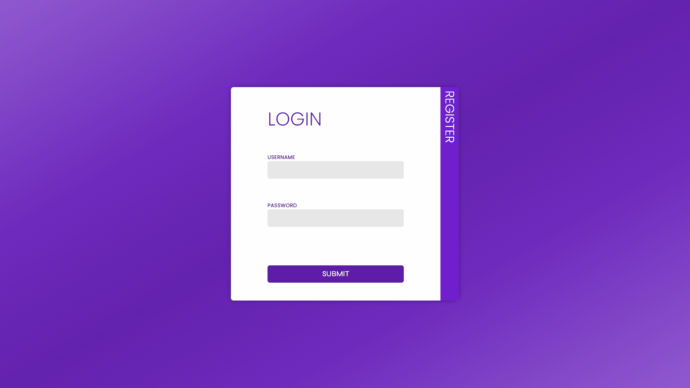
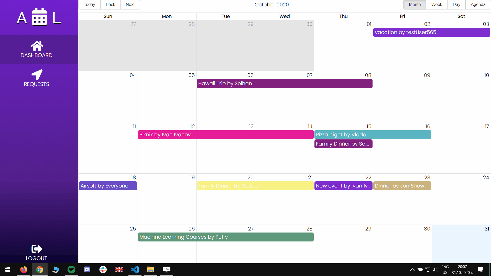

# 📅 leave-request-tracker
An HR software for tracking employee absence and paid days off within a company.
## ✨ Features:
- #### User:
  - Create an employee account with a unique color for distinctive representation in the calendar.
    

  - Make leave requests with dates of your choosing, by using drag and drop.
    

  - Browse all approved employee leaves in the dashboard.
- #### Admin:
  - Navigate to an admin only panel and manage leave requests for all employees.
    

## :exclamation: Run examples locally
 - #### on Windows:

  `$ git clone git@github.com:scavasoft/leave-request-tracker.git`   
  `$ cd frontend`  
  `$ npm install`  
  `$ npm run start`    
  `$ cd..`  
  `$ cd backend`  
  `$ npm install`   
  `$ nodemon app.js`  
  
 - #### on Linux:
  `$ git clone git@github.com:scavasoft/leave-request-tracker.git`  
  `$ npm install`  
  `$ on root directory 'npm run dev'`  
 ## Technologies
  - #### Backend:
    - SQLite for database
    - Node.js
    - Express.js
  - #### Frontend:
    - React.js
    - Redux
  
